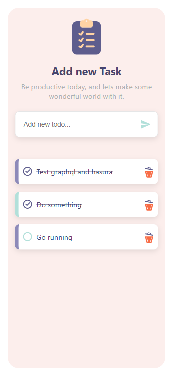

# GraphQL Todo List

This is a simple todo list with GraphQL.

## Table of contents

- [Overview](#overview)
  - [The challenge](#the-challenge)
  - [Screenshot](#screenshot)
- [My process](#my-process)
  - [Built with](#built-with)
- [Author](#author)

## Overview

### The challenge

Users should be able to:

- View the optimal layout for the component depending on their device's screen size
- See hover states for all interactive elements on the page
- Hide/Show the answer to a question when the question is clicked

### Screenshot

#### Mobile Design

### Links

- Live Site URL: [Live URL](https://todoline.netlify.app)

### Built with

- React.js
- GraphQL
- CSS
- Mobile-first workflow

## Author

- Website - [TodoLine](https://todoline.netlify.app)
